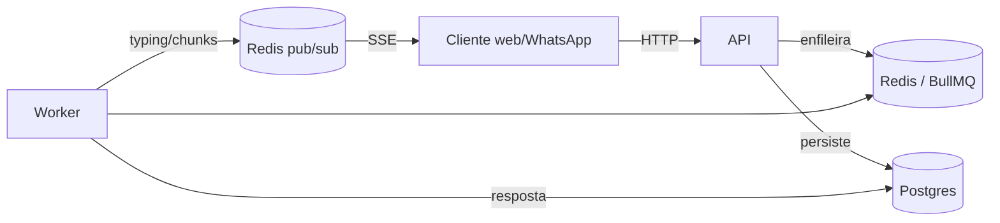

# README que justifica, não descreve

Avaliador lê o README antes do código. Cada seção responde "por quê", com o custo aceito.

## Esqueleto

```markdown
# <Serviço> — <uma frase>

## Rodar
docker compose up --build         # sobe Postgres, Redis, migrations, seed e a API
curl localhost:3000/health/ready  # {"status":"ok"}
Swagger: http://localhost:3000/docs · Token de demonstração: <como obter>

## Testar o tempo real
curl -N -H "Authorization: Bearer $TOKEN" localhost:3000/conversations/$ID/events
# em outro terminal:
curl -X POST localhost:3000/conversations/$ID/messages -H "Idempotency-Key: $(uuidgen)" ...

## Arquitetura

Cinco linhas sobre o porquê dessa forma.

## Decisões e trade-offs
### Por que <decisão>? (uma subseção por decisão)
Contexto · Opções consideradas · Escolha · Custo aceito · O que mudaria com mais tempo/escala

## Modelo de dados
diagrama ER (mermaid erDiagram) · como a ordem é garantida · paginação · busca

## Tempo real e filas
fluxo do turno · o que acontece na falha · reconexão · duas réplicas

## Segurança
auth · escopo por usuário · webhook assinado · segredos

## Testes
comandos · o que cada suíte prova · como rodar os de integração (Docker necessário)

## Operação
health · logs · métricas · shutdown

## Matriz de requisitos
link para docs/matriz-requisitos.md (item → onde está provado)

## O que faria diferente com mais tempo
lista honesta, uma linha cada, com o porquê de não ter feito agora
```

## Decisões que um avaliador sênior procura (para este tipo de serviço)

- Ordenação estável (por que `seq` sob lock e não `created_at`)
- Cursor vs offset
- Idempotência no banco (chave do cliente vs id do provedor; índice parcial)
- BullMQ: attempts, backoff, DLQ, jobId determinístico; o que acontece com "pendente"
- SSE vs WebSocket; pub/sub vs Streams para retomada; o que se perde na queda
- Cache do contexto e invalidação
- Full-text search: dicionário, índice, limites
- Segurança do webhook (HMAC, replay) e auth do SSE
- Docker: multi-stage, não-root, entrypoint com migrations/seed
- Testes: o que é integração real, o que é mock, por quê

## ADR (docs/adr/NNNN-titulo.md)

```markdown
# NNNN — <título em forma de decisão>
Data · Status (aceito/superado)
## Contexto
## Decisão
## Alternativas consideradas
## Consequências (positivas e negativas)
```

## Diagramas Mermaid que costumam bastar

- `flowchart` de componentes (acima)
- `sequenceDiagram` do envio → worker → SSE, incluindo o ramo de falha
- `erDiagram` com `users ||--o{ conversations : tem`, `conversations ||--o{ messages`
- `stateDiagram-v2` do turno (`pending --> processing --> streaming --> completed`)

## Preparar a conversa técnica (docs/perguntas-e-respostas.md)

Para cada decisão: a pergunta que um sênior faria ("e se duas réplicas atribuírem o
mesmo `seq`?"), a resposta em 3 linhas, o arquivo que prova. Inclua as perguntas
desconfortáveis ("por que não fez X?") com a resposta honesta.

## Commits

Conventional Commits (`feat(messages): ...`, `fix(worker): ...`), um commit por passo
do blueprint, corpo explicando **por quê** quando não é óbvio. Histórico incremental que
conta a história da entrega.
