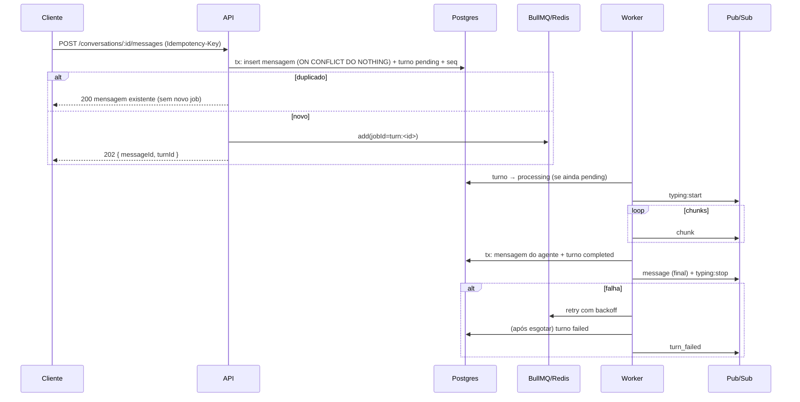

# O turno assíncrono com streaming e falha — desenho de referência

## Contents
- Estados
- Sequência
- Provedor mockado verossímil
- Contexto e cache
- O que nunca pode acontecer

## Estados

Um registro por turno (tabela `agent_turns` ou a própria mensagem do agente com `status`):

```
pending ──▶ processing ──▶ streaming ──▶ completed
   │             │             │
   └─────────────┴─────────────┴──▶ failed (reason, attempts)
```

- `pending`: criado na mesma transação da mensagem do usuário; `turnId` gerado aqui e
  usado como `jobId`.
- `processing`/`streaming`: o worker atualiza com `updated_at`; chunks vão para pub/sub
  (+ Streams, se houver retomada), **não** para o banco um a um.
- `completed`: conteúdo final persistido como mensagem do agente (com `seq` atribuído
  pela mesma regra de ordenação) na mesma transação que fecha o turno.
- `failed`: depois de esgotar tentativas ou por erro não-retentável; a conversa recebe
  um evento `turn_failed` e, opcionalmente, uma mensagem de sistema visível ("não
  consegui responder agora").

**Reconciliador**: job periódico (ou verificação no `GET` da conversa) que marca como
`failed` turnos em `processing`/`streaming` com `updated_at` mais velho que o timeout
máximo — cobre worker morto sem graceful shutdown.

## Sequência



## Provedor mockado verossímil

```ts
interface AgentProvider {
  generate(ctx: TurnContext, signal: AbortSignal): AsyncIterable<string>;
}
```

- Implementação mock configurável por env: `AGENT_LATENCY_MS` (por chunk, com jitter),
  `AGENT_FAILURE_RATE` (0.15 em dev, **0 em testes determinísticos**), `AGENT_SEED`.
- Falha simulada = lançar erro **antes** de qualquer efeito persistido, ou no meio do
  streaming — teste os dois; o segundo prova que chunks parciais não viram mensagem.
- Resposta coerente sem NLP: intenção por palavras-chave sobre o contexto ("gastei",
  "mercado", "saldo", "mês passado") → consulta agregada nos dados financeiros do seed
  (soma por categoria/período) → template de resposta com os números. Fallback genérico
  que cita a última pergunta. O design limpo é a porta `AgentProvider` + um
  `IntentResolver` trocável, não a "inteligência".

## Contexto e cache

- `TurnContext` = últimas N mensagens (N configurável) + resumo financeiro do usuário
  (agregados do seed) + canal.
- Cache em Redis `ctx:<conversationId>` com TTL; invalidado a cada nova mensagem
  persistida (usuário ou agente). O worker monta o contexto **depois** de marcar
  `processing`, lendo cache-aside.

## O que nunca pode acontecer

| Cenário | Defesa |
|---|---|
| Reenvio de rede duplica mensagem | `UNIQUE(conversation_id, idempotency_key)` + resposta 200 com a existente |
| Webhook entregue duas vezes | `UNIQUE(channel, provider_message_id)` |
| Job reprocessado gera duas respostas | jobId determinístico + worker revalida estado + `UNIQUE(turn_id)` na mensagem do agente |
| Worker morre no meio | reconciliador marca `failed`; retry do BullMQ (stalled) reprocessa idempotente |
| Cliente cai durante o streaming | reconexão com cursor; mensagem final está no banco |
| Duas réplicas | pub/sub faz o fan-out; teste subindo duas instâncias no compose |
| Ordem embaralha sob concorrência | `seq` atribuído sob lock da conversa; cliente ordena por `seq` |
